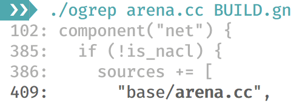

# Outline grep

Featureful tool for searching in indentation-structured text files.

Inspired by [ogrep by Matt Brubeck](https://github.com/mbrubeck/outline-grep). That ogrep is compact and beautiful, but not featureful.

See also [ogrep](https://github.com/kriomant/ogrep) — port of this tool written in Python (to be truly, it was first).

## Brief

`ogrep` is much like `grep`, both can search for matches and display their context. But context in `grep` is “N lines before/after match”, and in `ogrep` it is “lines above matched one with lower indentation”.

Let me explain. I use this tool mostly when working with GN build files, so I'll use [some large BUILD.gn](https://cs.chromium.org/codesearch/f/chromium/src/net/BUILD.gn?cl=a94640abec90972d53ed35816363df2e8eabef63) file as an example. Usual task is to search for source file name and understand which target includes this file and under which conditions.

Let's find mentions of “arena.cc” file:

```
# grep arena.cc BUILD.gn
      "base/arena.cc",
```

Ok, now we now that our file is here, but don't know target. Let's ask for some context:

```
# grep -C2 arena.cc BUILD.gn
      "base/address_tracker_linux.cc",
      "base/address_tracker_linux.h",
      "base/arena.cc",
      "base/arena.h",
      "base/backoff_entry.cc",
```

Nope, not that useful. Let's try `ogrep`:

```
ogrep arena.cc BUILD.gn
 102: component("net") {
 385:   if (!is_nacl) {
 386:     sources += [
 409:       "base/arena.cc",
```

Now that's useful! We immediately know that file in included into “net“ target under “!is_nacl” condition.

It is even better, because `ogrep` can use colors, here is a picture:



## Installation

### Using Cargo (any platform)

Install [Rust and Cargo](https://www.rust-lang.org/install.html), if you haven't yet, then

```sh
cargo install ogrep-rs
```

### MacOS

Install [Homebrew](https://brew.sh), then

```sh
brew install kriomant/ogrep-rs/ogrep-rs
```

### Other platforms

Sorry, not yet, but I'm working on it. Use Cargo for now.

## Options

There are plently of available options, run with `--help` to list them.

Tool is useful not only for strict indentation-based files (like Python source) or GN build files, but for wide range of text files, because even not-indentation based ones are usually formatted for convenience.

There are even some C-related hacks built-in.

Here is brief feature list:

 * Pattern is fixed text by default, but you may use arbitrary regular expression with `-e`.

 * Usual `-w` (match whole words) and `-i` (case-insensitive search) are available.

 * Tool preserve some blank lines between matches, because it helps to visually separate groups of related matches, you can turn it off with `--no-breaks`.

 * Sometimes it is useful to see whether there were other lines between matched ones. Use `--ellipsis` for that.

 * If you integrate `otool` with external tools, `--print-filename` options may be useful, it tells to print filename if any match found.

 * By default “if-else” branches are treated specially: if-branches are preserved so you know conditions even when match is found in “else” branch:

 * Traditional context (displaying N leading and/or trailing lines around
   matched one) is also supported with `--context/-C`, `--before-context/-B`
   and `--after-context/-A` options.

  ```
 # ./ogrep filename_util_icu BUILD.gn
  102: component("net") {
 2106:   if (!is_nacl) {
 2210:     if (use_platform_icu_alternatives) {
 2222:     } else {
 2228:       sources += [
 2229:         "base/filename_util_icu.cc",
 ```

 This can be turned off with `--no-smart-branches`.

 * Preprocessor instructions in C files are often written without any indentation (or indentation is inserted after “#”). So tool ignores preprocessor instructions by default until `--no-ignore-preprocessor` is given.

 More intelligent handling of preprocessor instructions (parallel context) is planned.

## Searching in directory

### Integration with external tools

`otool` in intended to search in single file only. And it is not so fast to be used for searching through many files. But you can integrate it with other search tools like this:

```
grep -l cache_used -r . --include='*.cc' | xargs -n1 ogrep --print-filename cache_used
```

### Builtin `git grep` support

`ogrep` has builtin integration with `git grep`: when `-g` option is given, second argument is passed to `git grep` as path specification. All relevant options (`-w`, `-i`, etc.) are also passed to `git grep` automatically, `--print-filename` is forced.

```
ogrep -g cache_used '*.cc'
```
